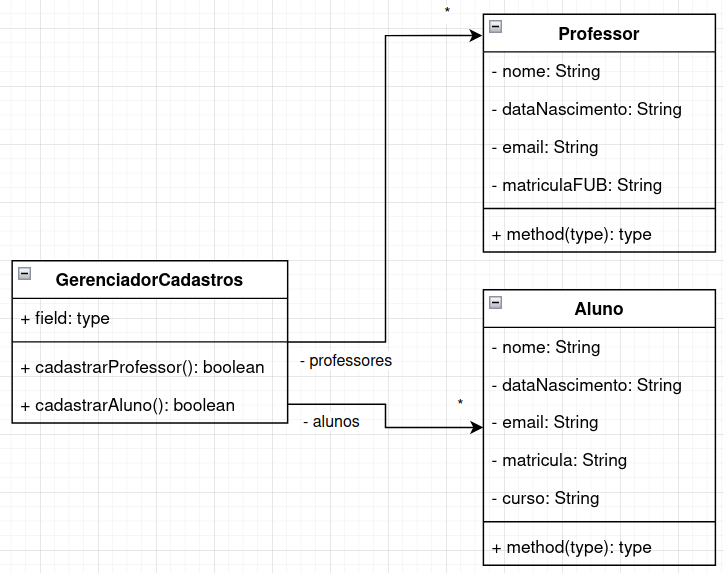

UnB - Universidade de Brasilia  
FGA - Faculdade do Gama  
FGA0158 - Orientação por Objetos

---

## Aula 9 - Herança

**Tópicos da aula**
Herança:
- Herança simples
- Herança múltipla
- Agregação e delegação

**Slides da aula**

* [Slides](https://docs.google.com/presentation/d/1WyVHU2jWJYvL3mtqZuCYZ2pF3FAS3UIS4YfStOJXAq8/edit?usp=sharing)

**Vídeos da aula**
* [Video](link para o video)
* [Video - modelagem UML](https://youtu.be/ufhNxklyZIk)
* [Video](link para o video)


**Exemplo feito em aula**
* [Arquivo do modelo UML feito em Draw.io](exemploHeranca.drawio)

Cadastro de professores e alunos, sem utilização de herança:  


Cadastro de professores e alunos, com utilização de herança para generalizar
atributos e métodos:    


Cadastro de professores e alunos, com utilização de herança utilizando uma
referência de uma superclasse (```PessoaFísica```) para referenciar objetos de
suas subclasses:    


**Vídeos da aula**
* [Video](link para o video)
* [Video - modelagem UML](https://youtu.be/ufhNxklyZIk)
* [Video](link para o video)


**Exemplo feito em aula**
* [Arquivo do modelo UML feito em Draw.io](exemploHeranca.drawio)

Cadastro de professores e alunos, sem utilização de herança:  


Cadastro de professores e alunos, com utilização de herança para generalizar
atributos e métodos:    


Cadastro de professores e alunos, com utilização de herança utilizando uma
referência de uma superclasse (```PessoaFísica```) para referenciar objetos de
suas subclasses:    


**Exercícios de fixação**


