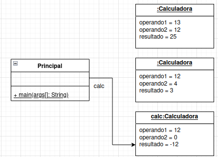

UnB - Universidade de Brasilia  
FGA - Faculdade do Gama  
FGA0158 - Orientação por Objetos

---

## Aula 6 - Introdução a Orientação por Objetos - Parte 2

**Tópicos da aula**

- Construtores / Destrutores
- Referência a objetos
- Associações entre objetos
- Comunicação entre objetos: troca de mensagens


**Slides da aula**  

- [Slides](https://docs.google.com/presentation/d/1rbcLtza79uKjhLKr0O3j3TOspWm5aaVBk2J47wL0xp8/edit?usp=sharing)


**Exercícios de fixação**

1. Implemente um programa em Java capaz de representar os seguintes diagramas
   UML de Classes e de Objetos.  

Diagrama de classes:  
  

Diagrama de objetos:  


Enquanto o usuário desejar realizar cálculos, o
programa deverá ser capaz de ler os valores (operandos) e a operação desejada e,
através de um objeto Calculadora calcular o resultado. O objeto, quando for
destruído pelo _garbage collector_ imprimir a seguinte mensagem: ```Destruindo
Calculadora com estado: op1: <valor>, op2: <valor>, resultado: <valor>``` em
que ```<valor>``` é o valor que o atributo armazena no momento. Exemplo de
execução do programa:  
```
Usuário desejar realizar um cálculo? (s/n)
S
Informe o valor do operando1: 
13
Informe o valor do operando2: 
12
Informe a operação desejada: (+, -, *, /, ! -> inversão de sinal)
+
O resultado de 13 + 12 é 25.

Usuário desejar realizar um cálculo? (s/n)
S
Informe o valor do operando1: 
12
Informe o valor do operando2: 
4
Informe a operação desejada: (+, -, *, /, ! -> inversão de sinal)
/
O resultado de 12 / 4 é 3.

Usuário desejar realizar um cálculo? (s/n)
S
Informe o valor do operando1: 
12
Informe o valor do operando2: 

Informe a operação desejada: (+, -, *, /, ! -> inversão de sinal)
!
O inverso de 12 é -12.

Usuário desejar realizar um cálculo? (s/n)
N
```


