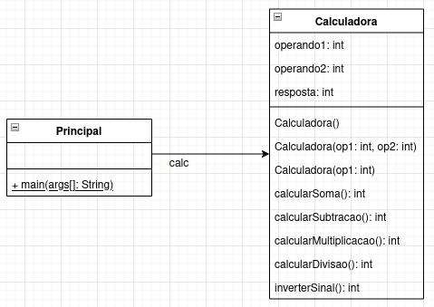

UnB - Universidade de Brasilia  
FGA - Faculdade do Gama  
FGA0158 - Orientação por Objetos

---

## Aula 7 - Introdução a Orientação por Objetos - parte 2

**Tópicos da aula**

- Referência a objetos
- Métodos Construtores / Destrutores
  - Coletor de lixo
- Associações entre objetos
- Comunicação entre objetos: troca de mensagens


**Slides da aula**  

- [Slides](https://docs.google.com/presentation/d/1rbcLtza79uKjhLKr0O3j3TOspWm5aaVBk2J47wL0xp8/edit?usp=sharing)


**Vídeos da aula**  

- [Vídeo 1 - conceitos](https://youtu.be/bSDMDZYtumc)
- [Vídeo 2 - prática, parte 1](https://youtu.be/i34dR92syzY)
- [Vídeo 1 - prática, parte 2](https://youtu.be/oWQfXWAyt5s)

**Exercícios da aula**  

- [Código-fonte](fga0158/)


**Exercícios de fixação**

1. Implemente um programa em Java capaz de representar os seguintes diagramas
   UML de Classes e de Objetos.  

Diagrama de classes:  
  

Diagrama de objetos:  


Enquanto o usuário desejar realizar cálculos, o
programa deverá ser capaz de ler os valores (operandos) e a operação desejada e,
através de um objeto Calculadora calcular o resultado. O objeto, quando for
destruído pelo _garbage collector_ imprimir a seguinte mensagem: ```Destruindo
Calculadora com estado: op1: <valor>, op2: <valor>, resultado: <valor>``` em
que ```<valor>``` é o valor que o atributo armazena no momento. Exemplo de
execução do programa:  
```
Usuário desejar realizar um cálculo? (s/n)
S
Informe o valor do operando1: 
13
Informe o valor do operando2: 
12
Informe a operação desejada: (+, -, *, /, ! -> inversão de sinal)
+
O resultado de 13 + 12 é 25.

Usuário desejar realizar um cálculo? (s/n)
S
Informe o valor do operando1: 
12
Informe o valor do operando2: 
4
Informe a operação desejada: (+, -, *, /, ! -> inversão de sinal)
/
O resultado de 12 / 4 é 3.

Usuário desejar realizar um cálculo? (s/n)
S
Informe o valor do operando1: 
12
Informe o valor do operando2: 

Informe a operação desejada: (+, -, *, /, ! -> inversão de sinal)
!
O inverso de 12 é -12.

Usuário desejar realizar um cálculo? (s/n)
N
```


2. Seja o cenário descrito a seguir:  
> Em uma universidade os alunos são cadastrados no sistema de gestão acadêmica
> com as seguintes informações: 
> * nome completo;
> * número de matrícula no formato aa/nnnnnnnnn, em que *aa* representa o ano de
>   ingresso do aluno na universidade e *nnnnnnn* representa uma sequencia de
>   números inteiros e,
> * endereço de email.  
>
> Nesse mesmo sistema de gestão acadêmica o curso é cadastrado com as seguintes
> informações: 
> * nome do curso; 
> * carga horária e,
> * turno (matutino, vespertino ou noturno).
> 
> As disciplinas da universidade também são cadastradas no sistema de gestão
> acadêmica, sendo que para cada disciplina cadastrada devem ser informados: 
> * nome da disciplina;
> * código da disciplina no formato DEP/NNNN, em que *DEP* representa o
>   departamento ou instituto ao qual a disciplina está vinculada e *NNNN*
>   representa uma sequência de números inteiros -- exemplo: FGA-0158;
> * Carga horária da disciplina e,
> * Professor responsável pela disciplina.  
> 
> Nessa Universidade há ainda as seguintes regras:  
> * a universidade pode ter vários cursos de graduação; 
> * cada curso de graduação tem várias disciplinas vinculadas a ele, 
> * uma disciplina pode estar vinculada a vários cursos de graduação (exemplo:
>   Calculo 1 é oferecido aos cursos de Matemática, Engenharias e Administração)
> * um aluno pode estar vinculado a apenas um curso de graduação da universidade
> * um curso possui vários alunos matriculados;

Considerando o cenário descrito acima, faça o que se pede:  

a) Crie um diagrama UML de classes representando as classes (e seus atributos)
capazes de representar os elementos descritos acima e suas relações. Dica: crie
também um diagrama UML de objetos para facilitar a visualização dos objetos e
suas relações.  
b) Crie um programa em Java que seja capaz de:  
- Criar vários objetos referentes a alunos, cursos e disciplinas;
- Relacionar esses vários objetos através de métodos apropriados. Por exemplo:
  defina o método ```matricularAluno```, responsável por matricular um aluno em
uma disciplina, o método ```cadastrarDisciplina``` capaz de cadastrar uma
disciplina em curso, o método ```criarCurso``` capaz de criar um curso para a
Universidade, etc... 
- Crie ainda os seguintes métodos de pesquisa:  
  - ```pesquisarAlunos``` capaz de pesquisar todos os alunos cadastrados em um
    determinado curso; 
  - ```pesquisarAlunos``` capaz de pesquisar todos os alunos matriculados em uma
    determinada disciplina;
  - ```emitirRelatórioAluno``` capaz de apresentar, para um dado aluno, qual o
    curso ele está cursando e quais as disciplinas em que ele está matriculado.
