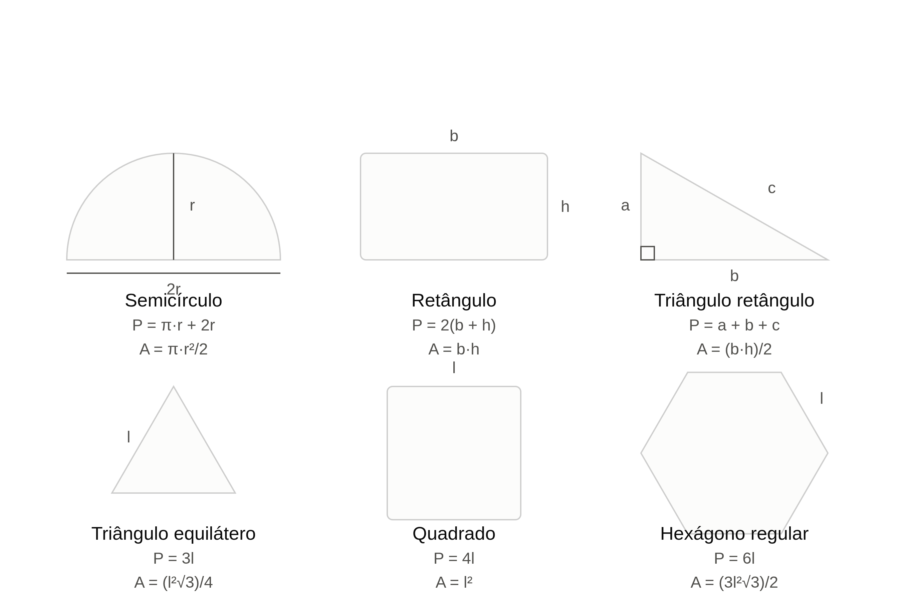
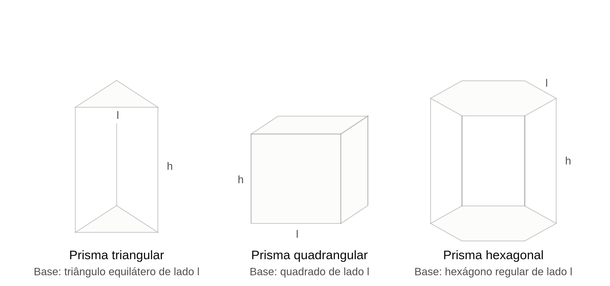
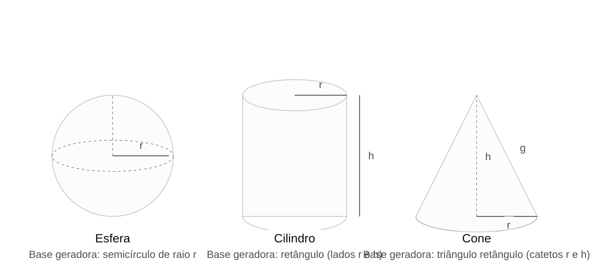

jjUnB - Universidade de Brasilia  
FGA - Faculdade do Gama  
FGA0158 - Orientação por Objetos

---

# Exemplo Didático

Os seguintes exemplos serão utilizados ao longo da disciplina para apresentação
dos conteúdos ministrados pelo professor. O intuito é que, com eles, o aluno
perceba ao longo do tempo como um projeto de software se beneficia dos conceitos
de Orientação por Objetos em sua construção. 

### Exemplo 1 - Progressão aritmética e Progressão geométrica

#### 1. Contextualização

Neste exercício, você irá construir um programa que gera os termos de uma
progressão aritmética (PA) ou geométrica (PG) a partir de dados informados pelo
usuário, e calcula a soma desses termos — reforçando tanto o raciocínio
matemático quanto a lógica de repetição (laços) em programação.

---

#### 2. Fundamentação matemática

Uma PA é uma sequência de números em que cada termo, a partir do segundo, é
obtido somando-se uma constante (razão **r**) ao termo anterior.

| Elemento | Fórmula |
|---|---|
| Termo geral | aₙ = a₁ + (n − 1)·r |
| Soma dos n primeiros termos | Sₙ = n·(a₁ + aₙ) / 2 |

Onde:
- **a₁** = primeiro termo
- **r** = razão (diferença constante entre termos consecutivos)
- **n** = número de termos
- **aₙ** = n-ésimo termo


Uma PG é uma sequência de números em que cada termo, a partir do segundo, é
obtido multiplicando-se o termo anterior por uma constante (razão **q**).

| Elemento | Fórmula |
|---|---|
| Termo geral | aₙ = a₁ · q^(n−1) |
| Soma dos n primeiros termos (q ≠ 1) | Sₙ = a₁ · (qⁿ − 1) / (q − 1) |
| Soma dos n primeiros termos (q = 1) | Sₙ = n · a₁ |

Onde:
- **a₁** = primeiro termo
- **q** = razão (fator multiplicativo constante entre termos consecutivos)
- **n** = número de termos
- **aₙ** = n-ésimo termo

**Atenção:** repare que a fórmula da soma da PG possui um caso especial quando q
= 1 (nesse caso, todos os termos são iguais a a₁ e a divisão por (q − 1) geraria
uma divisão por zero). Seu programa **precisa tratar esse caso**.

---

#### 3. O que o programa deve fazer

Construa uma **calculadora de progressões interativa** com o seguinte fluxo:

1. Exibir um menu para o usuário escolher o tipo de progressão:
   ```
   Escolha o tipo de progressão:
   1 - Progressão Aritmética (PA)
   2 - Progressão Geométrica (PG)
   ```
2. Solicitar ao usuário:
   - O primeiro termo (a₁);
   - A razão (r para PA, q para PG);
   - O número de termos (n) que deseja gerar.
3. Calcular e exibir:
   - **Todos os n termos** da progressão, em ordem (a₁, a₂, a₃, ..., aₙ);
   - O **último termo** (aₙ), calculado pela fórmula do termo geral;
   - A **soma de todos os n termos** (Sₙ), calculada pela fórmula da soma (não
     somando um a um os termos gerados, veja a Seção 4).
4. Perguntar se o usuário deseja fazer um novo cálculo ou encerrar o programa.

---

#### 4. Requisitos técnicos (regras de implementação)

1. **Modularização obrigatória:** implemente funções separadas para cada
responsabilidade, por exemplo:
   - `termo_geral_pa(a1, r, n)` e `termo_geral_pg(a1, q, n)`
   - `soma_pa(a1, r, n)` e `soma_pg(a1, q, n)`
   - `gerar_termos_pa(a1, r, n)` e `gerar_termos_pg(a1, q, n)` (retornam a
     lista/vetor com todos os termos)
2. **Duas formas de calcular a soma:** seu programa deve calcular a soma dos
   termos de **duas maneiras diferentes** e comparar os resultados:
   - Por **laço de repetição**, somando termo a termo (soma acumulada);
   - Pela **fórmula fechada** de Sₙ apresentada na Seção 2.
   
   Exiba ambos os resultados na tela. Eles devem ser iguais -- isso serve como
uma verificação (uma espécie de "teste") de que sua implementação está correta.
3. **Reaproveitamento de código:** a função de soma pela fórmula fechada deve
   chamar a função de termo geral (para obter aₙ), em vez de recalcular a
fórmula do termo geral internamente.
4. **Validação de entradas:**
   - O número de termos (n) deve ser um número inteiro positivo (n ≥ 1); rejeite
     valores inválidos e solicite novamente.
   - Na PG, trate separadamente o caso em que a razão q = 1 (soma = n · a₁),
     conforme explicado na Seção 2.2.
   - Trate também o caso a₁ = 0 e o caso q = 0, refletindo sobre o que acontece
     com a progressão nesses casos.
5. **Formatação da saída:** exiba os termos separados por vírgula ou em uma
   lista numerada, e os resultados numéricos com até 2 casas decimais quando não
forem inteiros.
6. **Tratamento de exceções:** o programa não deve encerrar com erro caso o
   usuário digite um valor não numérico; exiba uma mensagem amigável e peça o
valor novamente.

---

#### 5. Exemplo de execução esperada

```
Escolha o tipo de progressão:
1 - Progressão Aritmética (PA)
2 - Progressão Geométrica (PG)
> 2

--- Dados da Progressão Geométrica ---
Primeiro termo (a1): 3
Razão (q): 2
Número de termos (n): 5

--- Termos gerados ---
a1 = 3
a2 = 6
a3 = 12
a4 = 24
a5 = 48

Último termo (a5): 48.00

Soma dos termos (por laço):    93.00
Soma dos termos (por fórmula): 93.00

Deseja calcular outra progressão? (s/n): n
Programa encerrado.
```

---

#### 6. Desafio extra 

- Implemente uma opção **3 - Identificar progressão**, em que o usuário informa
  uma sequência de números (ex.: `2, 5, 8, 11, 14`) e o programa identifica se
ela é uma PA, uma PG, ou nenhuma das duas, informando a razão encontrada.
- Implemente o cálculo do **termo geral a partir de dois termos quaisquer** (não
  necessariamente a₁), por exemplo: dado que a₃ = 10 e a₇ = 26 em uma PA,
calcular a razão r e o primeiro termo a₁.
- Adicione uma opção para calcular a soma de uma **PG infinita decrescente**
  (quando |q| < 1), usando a fórmula S = a₁ / (1 − q), e explique no código por
que essa fórmula só é válida nesse caso.

---


### Exemplo 2 - Cálculo de área e perímetro de figuras geométricas planas, e área e volume de figuras geométricas sólidas. 


#### 1. Contextualização

Figuras geométricas planas regulares podem originar sólidos geométricos por dois
processos distintos:

- **Rotação (sólidos de revolução):** uma figura plana gira em torno de um eixo,
  "varrendo" o espaço e gerando um sólido.
- **Prisma:** um polígono regular serve de base e é "empilhado" (transladado) ao
  longo de um eixo perpendicular a ele, formando um prisma reto.

Neste exercício, você irá aplicar esse conhecimento geométrico na prática,
construindo um programa que:

1. Calcule o **perímetro** e a **área** de uma figura plana regular;
2. Utilize essa figura como base/geratriz para calcular a **área de superfície**
   e o **volume** do sólido correspondente.


---

#### 2. Figuras contempladas

| Figura plana | Sólido gerado | Processo de geração |
|---|---|---|
| Semicírculo | Esfera | Rotação em torno do diâmetro |
| Retângulo | Cilindro | Rotação em torno de um dos lados |
| Triângulo retângulo | Cone | Rotação em torno de um dos catetos |
| Triângulo equilátero | Prisma triangular | Prisma (base triangular) |
| Quadrado | Prisma quadrangular (cubo/paralelepípedo) | Prisma (base quadrada) |
| Hexágono regular | Prisma hexagonal | Prisma (base hexagonal) |

---

#### 3. Fórmulas de referência

##### 3.1 Figuras planas



| Figura | Área | Perímetro |
|---|---|---|
| Semicírculo | A = (π · r²) / 2 | P = π·r + 2·r |
| Retângulo | A = b · h | P = 2·(b + h) |
| Triângulo retângulo | A = (b · h) / 2 | P = a + b + c |
| Triângulo equilátero | A = (l² · √3) / 4 | P = 3·l |
| Quadrado | A = l² | P = 4·l |
| Hexágono regular | A = (3 · l² · √3) / 2 | P = 6·l |


##### 3.2 Sólidos geométricos




| Sólido | Área de superfície | Volume |
|---|---|---|
| Esfera | A = 4·π·r² | V = (4/3)·π·r³ |
| Cilindro | A = 2·π·r² + 2·π·r·h | V = π·r²·h |
| Cone | A = π·r² + π·r·g (g = geratriz = √(r² + h²)) | V = (1/3)·π·r²·h |
| Prisma triangular | A = 2·(área da base) + 3·l·h | V = (área da base) · h |
| Prisma quadrangular | A = 2·l² + 4·l·h | V = l² · h |
| Prisma hexagonal | A = 2·(área da base) + 6·l·h | V = (área da base) · h |

 **Observação:** repare que, para os prismas, a área de superfície segue sempre
o mesmo padrão: `2 × (área da base) + (perímetro da base × altura)`. Você pode
(e deve!) usar isso para reaproveitar código.

---

#### 4. O que o programa deve fazer

Seu programa deve implementar uma **calculadora geométrica interativa** com o
seguinte fluxo:

1. Exibir um menu para o usuário escolher qual **figura sólida** deseja calcular:
   ```
   Escolha o sólido geométrico:
   1 - Esfera (a partir de um semicírculo)
   2 - Cilindro (a partir de um retângulo)
   3 - Cone (a partir de um triângulo retângulo)
   4 - Prisma triangular (a partir de um triângulo equilátero)
   5 - Prisma quadrangular (a partir de um quadrado)
   6 - Prisma hexagonal (a partir de um hexágono regular)
   ```
2. Solicitar ao usuário os dados necessários **da figura plana** correspondente
   (por exemplo, raio, base e altura, lado, catetos etc.);
3. Calcular e exibir:
   - O **perímetro** e a **área** da figura plana informada;
   - A **área de superfície** e o **volume** do sólido gerado;
4. Perguntar se o usuário deseja realizar um novo cálculo (repetir o processo) ou encerrar o programa.

---

#### 5. Requisitos técnicos (regras de implementação)

Para garantir um código organizado, você deve seguir as seguintes regras:

1. **Modularização obrigatória:** cada figura plana deve ter suas próprias
   funções de área e perímetro (ex.: `area_quadrado(lado)`,
`perimetro_quadrado(lado)`), e cada sólido deve ter suas próprias funções de
área de superfície e volume (ex.: `area_superficie_cubo(lado, altura)`,
`volume_cubo(lado, altura)`).
2. **Reaproveitamento de código:** as funções de área/volume dos sólidos devem
   **chamar** as funções de área/perímetro das figuras planas já implementadas,
em vez de recalcular tudo do zero. Por exemplo, a função de área de superfície
do prisma triangular deve *usar* a função de área do triângulo equilátero.
3. **Validação de entradas:** o programa não deve aceitar valores negativos ou
   iguais a zero para medidas (raio, lado, base, altura, catetos). Exiba uma
mensagem de erro e solicite o valor novamente.
4. **Formatação da saída:** todos os resultados devem ser exibidos com **2 casas
   decimais** e unidade de medida coerente (ex.: `cm²` para área, `cm³` para
volume).
5. **Uso de constantes:** utilize a constante de `π` disponível na biblioteca
   matemática da linguagem Java.
6. **Tratamento de exceções:** trate possíveis erros de entrada (ex.: usuário
   digitar texto em vez de número), sem que o programa "quebre" (encerre com
erro).

---

#### 6. Exemplo de execução esperada

```
Escolha o sólido geométrico:
1 - Esfera
2 - Cilindro
3 - Cone
4 - Prisma triangular
5 - Prisma quadrangular
6 - Prisma hexagonal
> 5

--- Dados do Quadrado (base do prisma) ---
Informe o lado do quadrado (cm): 4
Informe a altura do prisma (cm): 10

--- Resultados da figura plana (Quadrado) ---
Perímetro: 16.00 cm
Área: 16.00 cm²

--- Resultados do sólido (Prisma Quadrangular) ---
Área de superfície: 192.00 cm²
Volume: 160.00 cm³

Deseja calcular outro sólido? (s/n): n
Programa encerrado.
```

---

#### 7. Desafio extra

- Implemente uma opção **7 - Comparar sólidos**, em que o usuário informa
  medidas para dois sólidos diferentes e o programa indica **qual possui maior
volume** e **qual possui maior área de superfície**.
- Grave os resultados de cada cálculo em um arquivo de log (`.txt` ou `.csv`),
  com data/hora, figura escolhida, dados informados e resultados obtidos.

---


### Exercício 1 - Revisão de Computação Básica.
