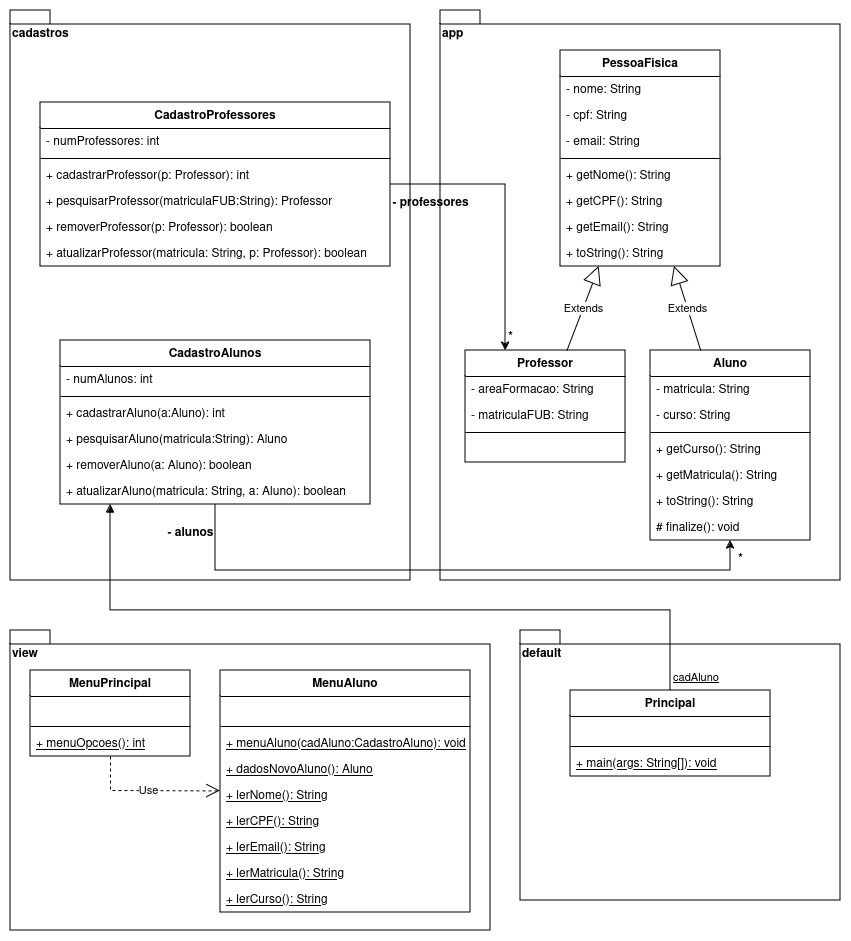

UnB - Universidade de Brasilia  
FGA - Faculdade do Gama  
OO - Orientação por Objetos  
Prof. André Luiz Peron Martins Lanna  

#### Trabalho Prático de Orientação por Objetos 
---

## Objetivo:  
O objetivo deste trabalho prático é aplicar os conceitos fundamentais de
Orientação por Objetos (OO), em especial os conceitos de Herança e Polimorfismo,
no contexto de um sistema de gestão acadêmico. Utilizando o cenário descrito
abaixo e o conjunto de classes presentes nesse diretório (como ponto de partida
para o trabalho), os grupos de quatro alunos deverão implementar um sistema em
Java que explore ao máximo os conceitos de Orientação por Objetos.

O diagrama de classes abaixo representa parte do que já está implementado. 

## Cenário da Oficina Mecânica:  
Um sistema de gestão acadêmica é responsável, basicamente, por realizar o
cadastro de todos os elementos pertencentes ao domínio de uma universidade. Por
exemplo, o sistema é responsável por cadastrar todos os alunos e professores,
todas as disciplinas, todas as turmas de cada disciplina e, por fim, todas as
salas de aulas. 

Esse sistem deve também ser capaz de criar turmas para cada disciplina e, para
cada turma, deve ser capaz de associar um professor e matricular os alunos,
ambos já existentes no cadastro. Para cada turma, o sistema deverá ser capaz de
imprimir a lista de presença que contenha, obrigatoriamente, o nome da
disciplina, o nome do professor daquela turma, o código da turma e a lista de
alunos (matricula e nome) matriculados. 

O sistema deverá ainda ser capaz de impedir o cadastro de elementos do domínio
que tenham valores em branco para qualquer um de seus atributos. Nesses casos
deverá lançar uma exceção do tipo "CampoEmBrancoException", em que na mensagem
do objeto de exceção seja informado qual o campo que ficou em branco. Com
relação às turmas, essas não poderão serem cadastradas se não tiver uma
disciplina e / ou um professor associado. Nesses casos deverão ser lançadas as
exceções "DisciplinaNaoAtribuidaException" e "ProfessorNaoAtribuidoException",
respectivamente. 

## Enunciado:  
O código presente no diretório já realiza o cadastro de Alunos mas sem tratar as
exceções listadas no cenário descrito acima. Para o trabalho faça o que se pede:
- Implemente o lançamento e tratamento de exceções para o cadastro de alunos;
- Implemente os cadastros faltantes (disciplinas, turmas e professores), em
  todas as suas operações: 
  - cadastrar
  - pesquisar
  - alterar
  - remover
- Para os novos cadastros, lance e trate as exceções listadas no cenário
  descrito acima.
- Imprima a lista de presença para uma data turma pesquisada. Exemplo: ao
  informar o codigo "t1", o programa vai listar a lista de disciplinas da turma
cadastrada com o código "t1".

## Entrega:  
O trabalho deve ser entregue no GitHub como um projeto Java, contendo o código
fonte, documentação adequada e exemplos de execução. O README do repositório
deve incluir informações sobre os componentes do grupo e a forma de execução do
programa.

## Avaliação:  
O trabalho deverá ser entregue até o dia 12/08/2024, pelo repositório do grupo.
O trabalho será avaliado quanto à completude e corretude dos cadastros (todos os
cadastros executam todas as operações desejadas e de modo correto), e quanto ao
lançamento e tratamento das exceções solicitadas. 

## Observações:
-  O trabalho deve ser realizado em grupos de quatro pessoas.
-  O trabalho deverá ser entregue em repositório do GitHub. O grupo deverá
   informar ao professor o endereço do repositório. 
-  Utilize boas práticas de programação.
-  A apresentação do código e a clareza da documentação também serão
   consideradas na avaliação.
